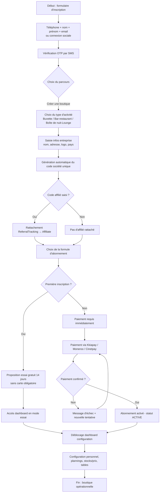
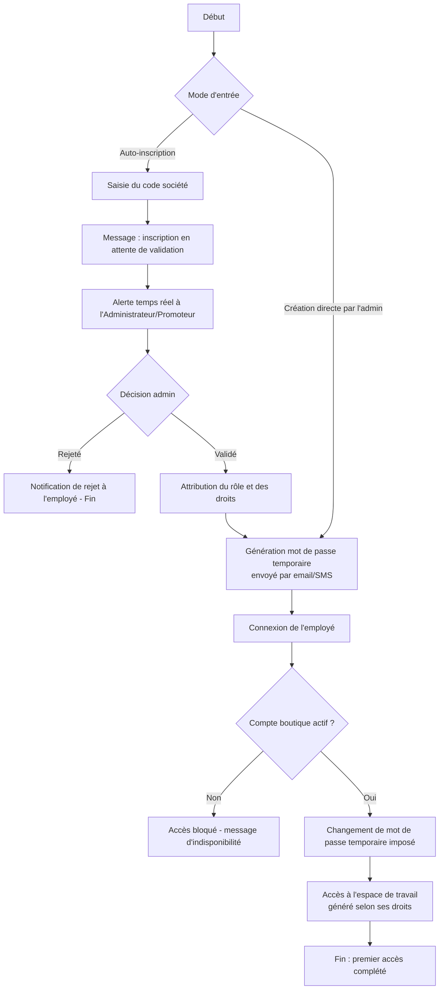
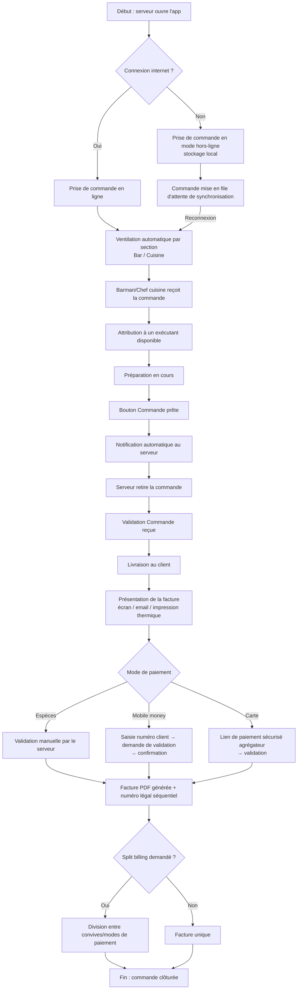
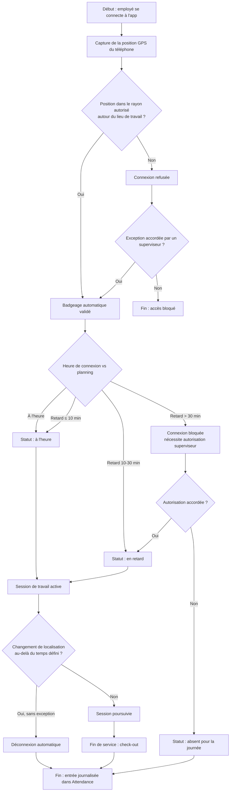
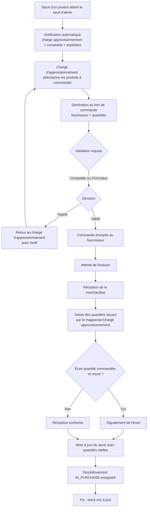
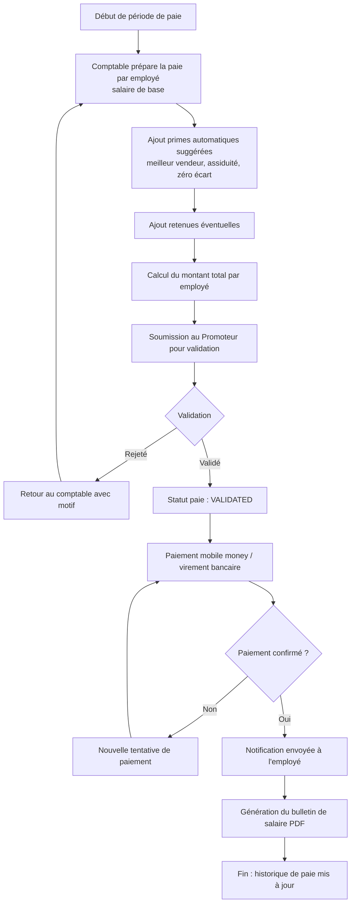
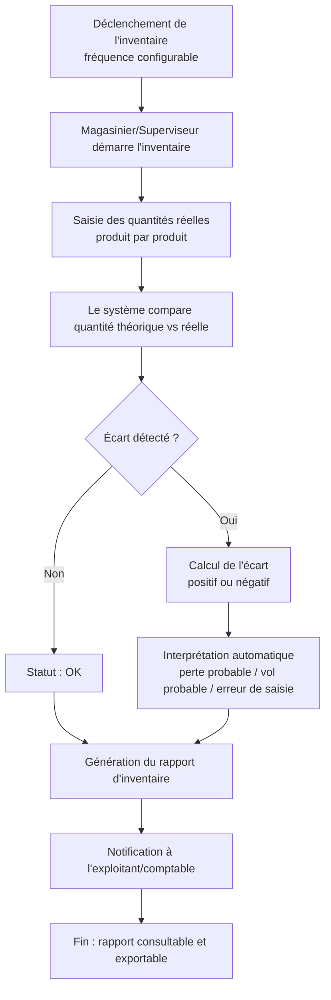
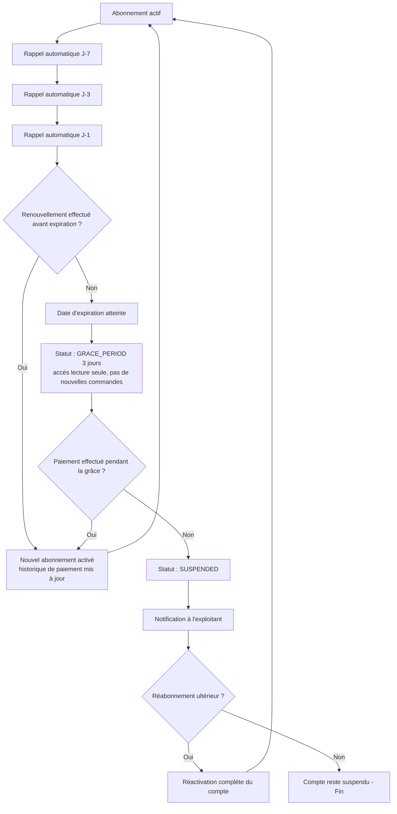
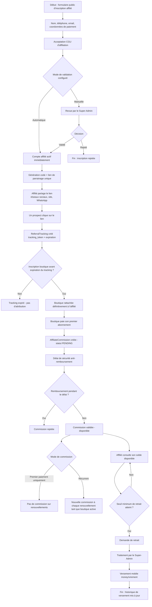

# Parcours utilisateurs (User Flows) — DebitManager

**Objectif du document :** fournir les diagrammes de flux de référence pour les parcours critiques du produit, afin que tous les agents développent le même enchaînement d'écrans et de règles, sans divergence d'interprétation. Chaque diagramme est en syntaxe Mermaid (flowchart), directement rendable dans un IDE ou une documentation compatible.

## 1. INSCRIPTION EXPLOITANT → ACTIVATION ABONNEMENT → CONFIGURATION BOUTIQUE

## 2. INSCRIPTION EMPLOYÉ → VALIDATION → PREMIER ACCÈS

## 3. PRISE DE COMMANDE → PRÉPARATION → LIVRAISON → PAIEMENT → FACTURE

## 4. BADGEAGE PRÉSENCE AVEC CONTRAINTE DE GÉOLOCALISATION

## 5. ALERTE STOCK → BON DE COMMANDE → VALIDATION → RÉCEPTION MARCHANDISE → MISE À JOUR STOCK

## 6. PRÉPARATION ET VALIDATION DE LA PAIE MENSUELLE

## 7. INVENTAIRE PHYSIQUE → CALCUL DES ÉCARTS → RAPPORT

## 8. RENOUVELLEMENT/EXPIRATION D'ABONNEMENT → PÉRIODE DE GRÂCE → SUSPENSION

## 9. INSCRIPTION AFFILIÉ → VALIDATION → PARTAGE DU LIEN → BOUTIQUE PARRAINÉE → COMMISSION → RETRAIT

---

*Ces diagrammes constituent la référence fonctionnelle des parcours critiques. Tout écart d'implémentation par rapport à ces flux doit être justifié et documenté avant mise en production.*
